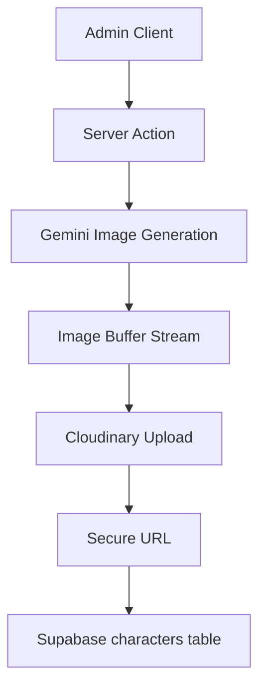

## Overview

This spec defines two admin-side enhancements for Raree Show:

* **A-01 — Fuzzy-search entity selector**
* **A-02 — AI-generated character avatar pipeline**

The document formalizes:

* component contracts
* loading/error state behavior
* server-side security boundaries
* storage topology
* future-compatible extension points

---

# A-01 — Fuzzy Search Combobox

## Goal

Provide a scalable entity selector for:

* characters
* locations

The selector must support:

* fuzzy matching
* keyboard-first interaction
* large client-side datasets
* graceful loading states

---

## Constraints

### UI Library (Mandatory)

Use:

* `shadcn/ui`
* `Combobox`
* `cmdk`

No custom dropdown implementation is allowed.

---

### Performance Boundary

The v1 design assumes:

* dataset size: `< 1000 entities`
* preload-on-open strategy
* client-side fuzzy filtering only

Server-side search is explicitly out of scope for v1.

---

## Component Contract

```ts
type EntityOption = {
  id: string
  label: string
  aliases?: string[]
}

type FuzzyComboboxProps = {
  value?: string
  options: EntityOption[]

  placeholder?: string
  loading?: boolean
  disabled?: boolean

  onSelect: (option: EntityOption) => void
}
```

---

## Filtering Behavior

### Matching Rules

The search implementation MUST support:

* substring matching
* typo-tolerant fuzzy matching
* alias matching

Prefix-only matching is prohibited.

---

### Recommended Matching Topology

Recommended stack:

```txt
cmdk
  +
custom scorer
  +
ranked client-side filtering
```

Recommended fuzzy libraries:

* `fuse.js`
* `match-sorter`

---

## Ranking Priority

Recommended ranking order:

1. exact label match
2. substring label match
3. fuzzy label match
4. alias match

---

## Interaction Behavior

### Keyboard Support

Required:

* arrow navigation
* enter-to-select
* escape-to-close

---

### Empty State

When no match exists:

```txt
No matching results.
```

---

### Loading State

During async entity loading:

* disable input interaction
* render loading skeleton
* preserve layout height
* avoid layout shift

Required states:

```txt
Idle
Loading
Ready
Empty
Error
```

---

## Data Loading Strategy

### Recommended Flow

```txt
Dialog Open
    ↓
Fetch entities
    ↓
Cache in client memory
    ↓
Client-side fuzzy filtering
```

---

### Cache Expectations

The entity dataset SHOULD remain cached during the current admin session.

Repeated modal openings SHOULD NOT re-fetch entities unless explicitly invalidated.

---

## Non-goals (v1)

Excluded from scope:

* server-side search
* infinite scrolling
* virtualization
* multilingual ranking optimization
* semantic/vector search

---

# A-02 — AI Avatar Generation Pipeline

## Goal

Allow admins to generate character avatars using Gemini image generation while preserving:

* API-key isolation
* deterministic storage flow
* DB consistency
* future extensibility

---

## Security Constraints

### API Key Boundary (Mandatory)

`GEMINI_API_KEY` MUST remain server-only.

The frontend MUST NEVER:

* access Gemini directly
* receive the API key
* construct Gemini requests

All generation requests MUST flow through a Server Action.

---

## Storage Topology

### Canonical Flow



---

## Upload Constraints

### Cloudinary Rules

Use:

* Cloud: `dnuxz94n5`
* Upload preset: `raree-show-admin`

The generated image buffer MUST upload directly to Cloudinary.

Temporary filesystem persistence is discouraged.

---

## Database Contract

Only the Cloudinary secure URL is persisted.

Example:

```ts
type CharacterAvatarRecord = {
  avatar_url: string
}
```

Raw image buffers MUST NOT be stored in Supabase.

---

## Prompt Construction

### Base Prompt Topology

Generation input SHOULD combine:

```txt
Character Name
    +
Character Description
```

Example:

```txt
Bran — a cold northern swordsman with grey eyes and a scar on the cheek
```

---

## Prompt Ownership

Prompt construction MUST remain server-side.

The frontend SHOULD NOT assemble final prompts.

---

## UI State Contract

### Required States

```txt
Idle
Generating
Success
Error
```

---

### Generating State Rules

While generation is running:

* disable generate button
* prevent duplicate submissions
* show spinner or progress indicator
* preserve button layout width

Recommended label:

```txt
Generating...
```

---

### Error State

If generation fails:

* preserve existing avatar
* show non-blocking error feedback
* allow retry

Failed generations MUST NOT overwrite the existing avatar URL.

---

## Regeneration Policy

v1 allows:

* overwriting previous avatar URLs
* replacing existing generated images

Version history is explicitly out of scope.

---

## Future-Compatible Extension Contract

The generation contract SHOULD reserve future extension fields:

```ts
type CharacterAvatarGenerationInput = {
  name: string
  description: string

  // future extension
  referenceImageUrl?: string
  referenceStrength?: number
}
```

These fields are placeholders only.

v1 MUST NOT implement:

* reference-image conditioning
* identity consistency guarantees
* multi-image generation workflows

---

## Failure Boundary

If Cloudinary upload fails:

* DB update MUST NOT execute
* partial writes are prohibited

If Gemini generation fails:

* no upload attempt should occur

---

## Recommended Server Action Topology

```txt
Validate Input
    ↓
Build Prompt
    ↓
Call Gemini
    ↓
Receive Image Buffer
    ↓
Upload to Cloudinary
    ↓
Persist secure_url to Supabase
    ↓
Return final URL
```

---

## Non-goals (v1)

Excluded from scope:

* image editing
* multi-avatar batch generation
* style presets
* reference-image generation
* moderation pipeline
* generation history
* rollback/versioning
* CDN invalidation workflow

---

# Engineering Notes

## Recommended Separation

Suggested module boundaries:

```txt
/app/actions/generateCharacterAvatar.ts
/lib/ai/gemini.ts
/lib/cloudinary/upload.ts
/lib/prompts/avatar.ts
```

---

## Operational Recommendation

Generation logs SHOULD include:

* character id
* generation timestamp
* generation duration
* Cloudinary upload result

Do not log:

* API keys
* raw image buffers

---

# ADR Alignment Summary

This spec enforces:

* server-only secret ownership
* deterministic media persistence
* client-side fuzzy filtering boundaries
* future-compatible avatar contracts
* UI-state-driven interaction safety
