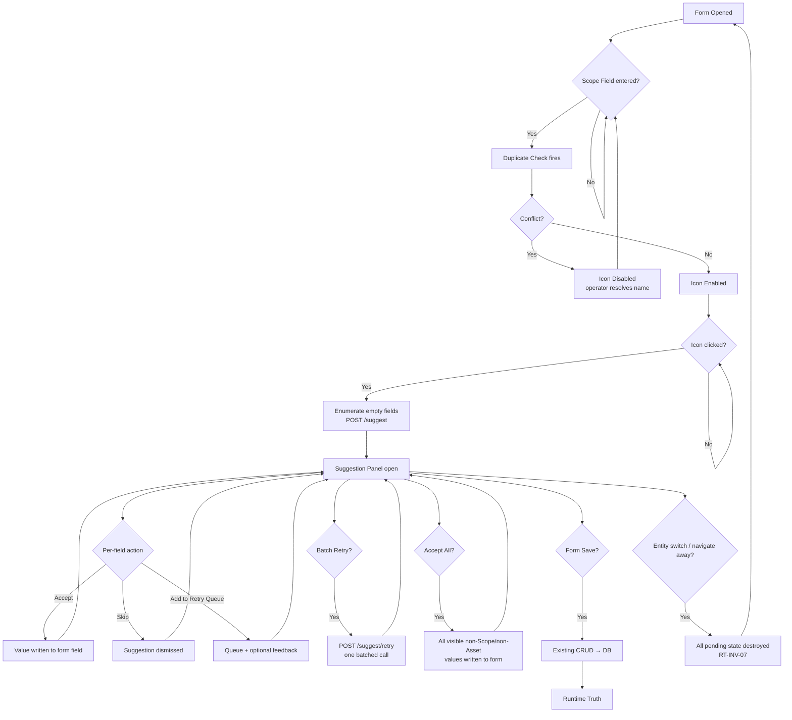

# SPEC-D2-002 — Enrichment Copilot: Field Suggestion & Human Acceptance

## Metadata

| Field        | Value                                                    |
| ------------ | -------------------------------------------------------- |
| Title        | Enrichment Copilot                                       |
| Status       | Draft                                                    |
| Version      | v0.1                                                     |
| Owner        | Architect                                                |
| Last Updated | 2026-06-08                                               |
| Derived From | ADR-004 v1.10 (docs/adr/004-source-of-canonical-truth.md) |

---

## 1. Purpose

### 1.1 Problem Statement

Operators creating or editing Characters, Locations, and Scenes in the Raree Show Admin must manually research and fill every metadata field. This is slow and error-prone, particularly for canonical facts (house affiliations, regions, factions) that are retrievable from authoritative sources.

SPEC-D2-002 defines how the Enrichment Copilot assists operators by suggesting field values — while preserving the human as the sole authority over what becomes Runtime Truth.

### 1.2 Scope of This Spec (vs ADR-004)

ADR-004 defines the governance principles and invariants for the Copilot workflow. This specification translates those principles into:

- Concrete payload contracts for the suggestion and retry endpoints
- The operator session lifecycle with explicit state transitions
- Metadata-driven field routing rules
- Validation, error handling, and acceptance criteria sufficient to authorise implementation

This spec does not re-state ADR-004 rationale. On any conflict, ADR-004 v1.10 governs.

### 1.3 Relationship to ADR-001 (Superseded Bootstrap)

ADR-001 (Bootstrap Pipeline) is superseded by ADR-004. The Bootstrap batch-persist model, `clearExisting` flag, and `BootstrapPanel` trigger are explicitly rejected (ADR-004 Decision 7). No implementation of SPEC-D2-002 may import, extend, or reuse any ADR-001 components.

---

## 2. Scope

### In Scope

- Character entity Copilot session (creation and edit flows)
- Location entity Copilot session (creation and edit flows)
- Scene entity Copilot session (creation and edit flows)
- Fact Suggestion pipeline (SC-01, Source First)
- Narrative Suggestion pipeline (SC-02, LLM draft)
- Original-Work fallback (SC-03, yellow only)
- Source First principle (SC-04)
- Human Acceptance Gate (per-field and per-entity)
- Retry Queue and Batch Retry with operator feedback
- Metadata-driven field routing (no hardcoded field names)
- Confidence model (green / yellow)
- Duplicate check gate (pre-session)
- Minimal Source Connector interface contract
- `POST /api/admin/ai/suggest` endpoint contract
- `POST /api/admin/ai/suggest/retry` endpoint contract

### Out of Scope

- Entity Discovery of any kind (→ ADR-006; prohibited by RT-INV-04, AC-31)
- Reference Suggestion v1 implementation (RS-04, deferred; v1 route = Excluded)
- Catalog-level or Work-level Accept All (Decision 8)
- Source Connector implementation details (Open Library, Google Books, auth, rate limiting)
- Schema field registry migration — Appendix A is authoritative for Runtime Truth v1; future Schema Spec may assume ownership in a later version
- Content topology normalization (→ ADR-005)
- Any Bootstrap / ADR-001 components (`BootstrapPanel`, `clearExisting`, batch persist route)
- LLM provider selection
- Portrait or image generation (`portraitUrl`, `story_images_v2`)
- UI visualization form for confidence levels (→ UI Spec)
- Session ID server-side persistence strategy

---

## 3. User Flow

### 3.1 End-to-End Operator Journey

```text
Operator enters Scope Field (canonical_name / chapter_title)
    ↓
Duplicate check fires automatically on Scope Field input (AC-24)
    ↓ [conflict → icon stays disabled]   [pass → icon enabled]
Operator clicks Copilot icon (RT-INV-13 — sole trigger)
    ↓
System enumerates empty fields, routes by schema metadata (RT-INV-08, MD-01)
    ↓
POST /api/admin/ai/suggest → Fact pipeline (SC-01) + Narrative pipeline (SC-02)
    ↓
Suggestion Panel opens; operator reviews per-field suggestions
    ↓
Per-field actions: [Accept] | [Skip] | [Add to Retry Queue + optional feedback]
    ↓ (repeat as needed)
[Batch Retry] — single POST /api/admin/ai/suggest/retry with all queued fields + feedback
    ↓
[Accept All (entity-scoped)] accepts all currently visible non-Scope/non-Asset suggestions
    ↓
All accepted values live in form state only (RT-INV-10)
    ↓
Operator submits form → existing CRUD → database write → Runtime Truth
```

### 3.2 Session State Diagram



### 3.3 UI Entry Points per Entity Type

**Edit flows:**

| Entity    | URL                                          |
| --------- | -------------------------------------------- |
| Character | `/works/[workId]/characters/[charId]/edit`   |
| Location  | `/works/[workId]/locations/[locId]/edit`     |
| Scene     | `/works/[workId]/scenes/[sceneId]/edit`      |

**Creation flows:**

| Entity    | URL                                          |
| --------- | -------------------------------------------- |
| Character | `/works/[workId]/characters/new`             |
| Location  | `/works/[workId]/locations/new`              |
| Scene     | `/works/[workId]/scenes/new`                 |

> `/new` flows apply the same Copilot gate as edit flows: the Scope Field MUST be entered and pass duplicate check before the Copilot icon becomes eligible. The entity does not need to be persisted to the database for the Copilot session to begin (RT-INV-01, SD-01, AC-23/24).

---

## 4. Copilot Session Lifecycle

### 4.1 Phase 1 — Scope Creation (RT-INV-01, SD-01)

The operator enters the Scope Field for the entity:

- **Character / Location:** `canonical_name`
- **Scene:** `chapter_title`

The Scope Field MUST be provided by the operator. AI MUST NOT propose or generate the Scope Field value (Decision 9, SD-02). The Copilot icon MUST remain disabled until the Scope Field is non-empty and has passed duplicate check.

### 4.2 Phase 2 — Identity Validation / Duplicate Check (Decision 5, AC-23/24)

On Scope Field input, the system executes a `UNIQUE(work_id, name)` / `UNIQUE(work_id, chapter_title)` check using the **browser Supabase client** (`lib/supabase`) — no dedicated API endpoint is required (OQ-A).

```typescript
// Character / Location duplicate check pattern
const { data } = await supabase
  .from("characters" /* or "locations" */)
  .select("id")
  .eq("work_id", workId)
  .eq("name", scopeFieldValue)
  .maybeSingle();
const isDuplicate = data !== null;

// Scene duplicate check pattern
const { data } = await supabase
  .from("scenes")
  .select("tsid")
  .eq("work_id", workId)
  .eq("chapter_title", scopeFieldValue)
  .maybeSingle();
const isDuplicate = data !== null;
```

- Check fires on Scope Field `onChange` / `onBlur` (AC-24), not at persist time.
- **During async check:** icon remains **Disabled**. There is no loading or pending icon state in v1 (OQ-05 → A).
- **On conflict** (`isDuplicate === true`): icon stays Disabled; a conflict indicator is shown.
- **On pass** (`isDuplicate === false`): icon transitions to Enabled.
- If the Scope Field value changes after a passing check, the icon reverts to Disabled and the check re-fires.

### 4.3 Phase 3 — Suggestion Request Trigger (RT-INV-13, AC-25)

Copilot icon click is the **sole trigger** for suggestion generation. The system MUST NOT automatically trigger suggestion generation on Scope Field entry, form load, or any other event.

On icon click:
1. System enumerates all form fields currently empty (RT-INV-08).
2. Each empty field is classified via schema metadata (MD-01); no hardcoded field names.
3. Scope fields and Asset fields are filtered out of the request (AC-15, AC-29).
4. `POST /api/admin/ai/suggest` is called with the resulting field list.

### 4.4 Phase 4 — Fact Pipeline Execution (SC-01, SC-04)

> **Source Connector v1 — Stub (Architect Decision, 2026-06-11):**
> In Runtime Truth v1, the Source Connector is implemented as a stub that always returns
> `{ matched: false, tier: 3, results: [] }`. All canonical fields therefore fall through to
> SC-03 Original Work fallback and are returned as `classification: "narrative"`, `confidence: "yellow"`.
> This validates the full Human Acceptance Gate, Metadata Routing, and Copilot Workflow without a live
> knowledge source. Real Source Connector implementations (Open Library, Wikipedia, etc.) are deferred
> to the Source Connector Spec.

For each field classified as `canonical` (default route: Fact Suggestion):

1. **Source Connector** is queried using the minimal interface (§5.6):  
   Input: `{ entityType, scopeFieldValue, field, workId }`  
   Output: `{ tier: 1|2|3, results: SourceRef[], matched: boolean }`

2. If `matched = true` and `tier = 1`: evidence is normalised and a Fact candidate is produced with `confidence: "green"`.

3. If `matched = true` and `tier = 2`: candidate is produced with `confidence: "yellow"`.

4. If `matched = false` (no authoritative source): SC-03 Original Work fallback activates. The output MUST be returned as **`classification: "narrative"`** with **`confidence: "yellow"`** and **`sources: []`**. The field is demoted from a fact attempt to a narrative draft because no verified source exists — an unverified fact claim is not Canonical Truth (ADR-004 Source First Principle). Returning `classification: "fact"` with an empty `sources` array is forbidden (AC-12, AC-20).

5. When an authoritative source (Tier-1 or Tier-2) is available, pure model knowledge without source grounding MUST be rejected at the provider layer (AC-19, SC-04).

6. Generation prompt MUST NOT contain any instruction to produce or infer the Scope Field value (AC-16).

### 4.5 Phase 5 — Narrative Pipeline Execution (SC-02)

For each field classified as `narrative` (default route: Narrative Suggestion):

1. Input: accepted fact values from the current session + any evidence from Phase 4.
2. LLM generates a draft narrative value.
3. `confidence` defaults to `"yellow"` unless the value is directly source-grounded.
4. The pipeline MUST NOT return Scope or Asset fields in its output.

### 4.6 Phase 6 — Human Gate (Decision 2, RT-INV-10~12)

The Suggestion Panel opens after `/suggest` responds. For each suggestion the operator chooses:

- **Accept** — writes the suggested value directly into the corresponding form field's input UI, making it immediately visible to the operator as if they had typed it (RT-INV-10). Does not trigger a database write.
- **Skip** — dismisses the suggestion; the field remains empty.
- **Add to Retry Queue** — queues the field with optional feedback text for Batch Retry.
- **Accept All** — accepts all currently visible non-Scope, non-Asset suggestions (see §6.3).

Additionally, **outside the Panel**, on any form field that already contains a value:

- **Regenerate** — available **only on `narrative`-classified fields** with existing content. Sends a single request using the current field value as `previousSuggestion`. Returns a new `SuggestionItem`. Operator must Accept the new suggestion to overwrite the form field. See §9.5 for the full rule.

### 4.7 Phase 7 — Persistence via Existing CRUD (AC-01/02)

When the operator submits the form, accepted values are written to the database through the existing entity CRUD path. The Copilot does not open a separate write path. There is no direct suggestion-to-database route.

### 4.8 Phase 8 — Runtime Truth Establishment

After the CRUD write succeeds, the database record is the Runtime Truth for that entity. The Copilot session for this entity is complete.

### 4.9 Session Teardown Rules (RT-INV-07, AC-08)

When the operator navigates away from the current entity form (entity switch, browser navigation, or route change):

- All pending suggestions MUST be discarded from client state.
- The Retry Queue MUST be cleared.
- No pending state is persisted to the server.
- The next entity form starts a fresh Copilot session.

---

## 5. Metadata Routing

### 5.1 Three-Layer Separation (MD-01~04, Decision 13)

| Layer | Owner | Responsibility |
| ----- | ----- | -------------- |
| **Architecture** (ADR-004) | ADR | Defines valid classification types and valid route types |
| **Schema Registry** (Appendix A) | SPEC-D2-002 | Registers per-field `classification` and `copilot_route` for each entity type (Runtime Truth v1) |
| **Copilot Runtime** (implementation) | SPEC-D2-002 | Reads metadata at runtime; MUST NOT hardcode field names (AC-26, MD-01) |

Adding a new field to an entity type MUST require zero changes to Copilot runtime code (AC-27, MD-02). Adding a new entity type MUST require zero changes to Copilot routing logic (MD-03).

### 5.2 Field Classification Taxonomy (Decision 12, FC-01~04)

| Classification | Semantic Meaning |
| -------------- | ---------------- |
| `scope` | Defines entity identity; provided by operator; never AI-generated |
| `canonical` | Authoritative factual attributes; precision = 100% required |
| `narrative` | Descriptive prose; accuracy important but not precision-bound |
| `asset` | Binary/URL fields (images, files); permanently excluded from Copilot |

Classification and `copilot_route` are stored independently in schema metadata (AC-28, FC-02). Classification type does not directly dictate route — schema metadata does.

### 5.3 Default Classification × Route Mapping (Decision 13)

| Classification | Default Copilot Route |
| -------------- | --------------------- |
| `scope` | `excluded` |
| `canonical` | `fact` (SC-01) |
| `narrative` | `narrative` (SC-02) |
| `asset` | `excluded` (FC-03, non-overridable) |

Schema Spec may assign a non-default route to a field where justified, except: Asset fields MUST always be `excluded` regardless of any other metadata value (FC-03, AC-29).

### 5.4 Route Definitions

| Route | Behaviour |
| ----- | --------- |
| `excluded` | Field is filtered out before the suggest request is built; never appears in request or response |
| `fact` | Source Connector is queried first (SC-04); evidence → Fact candidate; confidence green (Tier-1) or yellow (Tier-2 / fallback) |
| `narrative` | LLM draft using accepted facts + evidence as context (SC-02); confidence yellow by default |
| `reference` | **v1 route = `excluded`** (OQ-03 → A, RS-04). Reference fields receive no suggestion of any kind in Runtime Truth v1. Full Reference Suggestion semantics are deferred to a future spec. |

### 5.5 Empty-Field Filter Gate (RT-INV-08/09)

Before building the suggest request, the client MUST filter the field list to include only fields whose current form value is empty. Fields that already contain a human-entered value MUST NOT be included (RT-INV-08, RT-INV-09). This applies whether the form is in creation (`/new`) or edit mode.

### 5.6 Schema Metadata Contract (MD-04)

SPEC-D2-002 defines the field registration shape required for Copilot routing. The per-field registry for Runtime Truth v1 is **Appendix A** of this document — it is the authoritative source for `classification` and `copilot_route` assignments. A future Schema Spec may assume ownership of the registry; until then, Appendix A governs.

**Minimum required fields per schema entry:**

```typescript
interface FieldMetadata {
  classification: "scope" | "canonical" | "narrative" | "asset";
  copilot_route:  "excluded" | "fact" | "narrative" | "reference";
}
```

**Minimal Source Connector interface** (full specification deferred to Source Connector Spec):

```typescript
interface SourceConnectorInput {
  entityType:      "character" | "location" | "scene";
  scopeFieldValue: string;
  field:           string;
  workId:          string;
}

interface SourceConnectorOutput {
  tier:    1 | 2 | 3;
  results: SourceRef[];
  matched: boolean;
}
```

SPEC-D2-002 mandates these interface shapes. Implementation details (which APIs to call, auth, caching, rate limiting) belong to the Source Connector Spec.

### 5.7 Extensibility Invariants (AC-26/27)

- The Copilot runtime MUST derive all field routing decisions from schema metadata only (AC-26).
- No field name, entity type name, or classification value MAY appear as a string literal in Copilot routing logic (MD-01).
- Adding a new field or entity type MUST NOT require any change to Copilot routing code (AC-27, MD-02/03).

---

## 6. Human Acceptance Gate

### 6.1 Foundational Principle (Decision 2, Invariant A)

> AI-generated content MUST NOT enter the database without explicit human acceptance.

A suggestion that has not been individually accepted by the operator MUST NOT be written to the database by any code path.

### 6.2 Accept Semantics (RT-INV-10, AC-02)

- **Accept** writes the suggested value into the corresponding form field's input UI, making it immediately visible to the operator — identical in appearance to a value the operator typed manually.
- Accept does NOT trigger a database write. The value is held in React form state and reaches the database only when the operator explicitly submits the form through the existing CRUD path.
- Accept MUST NOT overwrite a field that already contains a non-empty human-entered value (RT-INV-09), **with one exception:** when the suggestion originates from an explicit **Narrative Regenerate** action (§9.5), Accept MUST overwrite the existing value in the form field. The overwrite applies to form state only — database write still requires form Save → CRUD (Decision 3).

### 6.3 Accept All Semantics (RT-INV-12, AC-11)

- **Accept All** applies to: all suggestions **currently visible** in the Panel at the moment of the action that are not Scope-classified and not Asset-classified (OQ-02 → A).
- **Does NOT include:**
  - Suggestions the operator has already skipped in this session
  - Fields not yet generated (not in the current response)
  - Any suggestions from a different entity
- Accept All is bounded to the **current entity session**. There is no catalog-level or work-level Accept All (Decision 8, AC-03, AC-11).

### 6.4 Skip Semantics

- **Skip** dismisses the suggestion for the field in the current session.
- The field remains empty on the form.
- A skipped suggestion is NOT included in a subsequent Accept All.
- The operator may still manually type a value into the field after skipping.

### 6.5 Scope Field Pre-condition Gate (SD-01, AC-13/14)

- The Copilot icon MUST be disabled and unclickable if the Scope Field is empty.
- The suggest endpoint MUST reject requests that do not include a `scopeField` value (AC-14, 400 response).
- Scope fields MUST NOT appear in the suggestion response (AC-15).
- Generation prompts MUST NOT contain any instruction to produce the Scope Field value (AC-16, SD-02/03).

### 6.6 Duplicate Check Pre-condition Gate (Decision 5, AC-23/24)

- The Copilot icon MUST be disabled until both conditions are met: Scope Field is non-empty AND duplicate check has passed (AC-23).
- Duplicate check executes on Scope Field input — not at form save time (AC-24).
- On conflict: icon stays disabled; a conflict indicator is shown to the operator.

### 6.7 Forbidden Gate Behaviors

The following are explicitly prohibited:

| Forbidden Behavior | Governing Rule |
| ------------------ | -------------- |
| Catalog-level or work-level Accept All | Decision 8, AC-03 |
| Auto-persist AI content without operator accept | Decision 2, Invariant A |
| Auto-triggering suggestion generation on any event other than icon click | RT-INV-13, AC-25 |
| Overwriting an existing non-empty form value via Accept | RT-INV-09 |
| Persisting Scope or Asset fields via any Copilot action | AC-15, FC-03 |

---

## 7. Payload Contracts

### 7.1 Suggest Request

```
POST /api/admin/ai/suggest
```

```typescript
interface SuggestRequest {
  workId:      string;
  entityType:  "character" | "location" | "scene";
  entityId:    string;        // tsid (char_/loc_/scene_) or "new" for creation flows
  scopeField:  string;        // the current value of the Scope Field
  emptyFields: FieldRequest[];
}

interface FieldRequest {
  field:       string;        // field name from schema metadata
  copilot_route: "fact" | "narrative"; // pre-resolved by client from schema metadata
}
```

**Invariants:**
- `emptyFields` MUST contain only fields whose current form value is empty (RT-INV-08, AC-22).
- `emptyFields` MUST NOT contain any field with `copilot_route: "excluded"` (Scope, Asset, Reference in v1).
- Scope field names MUST be absent from `emptyFields` (AC-15/16).
- `entityId` MUST belong to `workId`; server rejects cross-work requests (AC-14).

### 7.2 Suggest Response

```typescript
interface SuggestResponse {
  suggestions: SuggestionItem[];
  sessionId?:  string | null; // optional correlation identifier for logging / tracing only
                              // server MUST NOT rely on sessionId for correctness
}

interface SuggestionItem {
  field:          string;
  value:          string;
  confidence:     "green" | "yellow";
  classification: "fact" | "narrative";  // AC-17
  sources:        SourceRef[];
}
```

**Invariants:**
- Scope field names MUST be absent from `suggestions` (AC-15).
- Asset field names MUST be absent from `suggestions` (FC-03, AC-29).
- `confidence` MUST be `"green"` or `"yellow"` only.
- `classification` MUST be `"fact"` or `"narrative"` only (AC-17).
- `classification: "fact"` MUST have at least one `SourceRef` in `sources` (AC-12). A `SuggestionItem` with `classification: "fact"` and `sources: []` is invalid and MUST NOT be returned.
- When the Fact pipeline produces no verified source (SC-03 path), the item MUST be returned with `classification: "narrative"`, `confidence: "yellow"`, and `sources: []`. Returning `classification: "fact"` for a source-miss is a protocol violation.

### 7.3 Source Reference Shape

```typescript
interface SourceRef {
  tier:     1 | 2 | 3;
  label:    string;      // human-readable source name
  url?:     string;      // link to source, if available
  excerpt?: string;      // relevant quoted text from source
}
```

Sources MUST be externally verifiable; AI MUST NOT fabricate source references (AC-12, SV-01~05). When no verifiable source exists, the provider MUST return SC-03 fallback rather than a fabricated `SourceRef`.

### 7.4 Retry Request

```
POST /api/admin/ai/suggest/retry
```

```typescript
interface RetryRequest {
  sessionId?:  string | null;       // optional correlation identifier for logging / tracing only;
                                    // server MUST NOT validate or rely on this value for correctness
  retryFields: RetryFieldRequest[];
}

interface RetryFieldRequest {
  field:              string;
  previousSuggestion: string;       // the suggestion value the operator is rejecting;
                                    // provides the model a referent for feedback
  feedback:           string | null; // operator feedback; MUST be passed to generation
                                    // prompt alongside previousSuggestion;
                                    // null = no additional guidance beyond the referent
}
```

**Invariants:**
- ALL queued fields MUST be included in a single batched call (RT-INV-11, AC-10). Retry MUST NOT be implemented as one request per field.
- Server MUST incorporate both `previousSuggestion` and `feedback` as prompt context for regeneration. `previousSuggestion` provides the referent; `feedback` provides the improvement direction. Retry is NOT a blind re-run.
- `feedback: null` with a `previousSuggestion` value is valid; the server regenerates with only the previous value as context (e.g., model may infer variety without explicit direction).
- `previousSuggestion` eliminates the need for server-side session storage: the client carries the previous result in the request payload.

### 7.5 Error Response Shape

```typescript
interface ErrorResponse {
  error: {
    code:    string;   // see §11.1 for codes
    message: string;
    fields?: string[]; // populated for INVALID_FIELD_REQUEST
  };
}
```

For partial suggestion failures (some fields succeed, some fail), the server returns HTTP 200 with both `suggestions` and an `errors` array:

```typescript
interface PartialSuggestResponse extends SuggestResponse {
  errors: Array<{ field: string; code: string; message: string }>;
}
```

### 7.6 Endpoint-Level Validation Rules

| Rule | Response |
| ---- | -------- |
| `scopeField` absent or empty | 400 `SCOPE_MISSING` |
| Any Scope field name present in `emptyFields` | 422 `INVALID_FIELD_REQUEST` |
| Any Asset field name present in `emptyFields` | 422 `INVALID_FIELD_REQUEST` |
| `entityId` does not belong to `workId` | 404 `ENTITY_NOT_FOUND` |
| ~~Retry `sessionId` unknown or expired~~ | ~~404 `SESSION_NOT_FOUND`~~ — _removed; `sessionId` is correlation-only_ |

---

## 8. Confidence Model

### 8.1 Two-Level Taxonomy

| Level | Value | Meaning |
| ----- | ----- | ------- |
| High confidence | `"green"` | Tier-1 sourced Fact Suggestion; operator can accept with minimal review |
| Review required | `"yellow"` | All other cases; operator SHOULD verify before accepting |

### 8.2 Mandatory Yellow Scenarios

The following scenarios MUST produce `confidence: "yellow"` and MUST NOT produce `"green"`:

- SC-02 Narrative pipeline (default yellow unless directly source-grounded)
- SC-03 Original Work fallback — fact generated from model knowledge when no Tier-1 or Tier-2 source matched (AC-20)
- Tier-2 sourced facts (only Tier-1 qualifies for green)
- Any case where source attribution originates from the AI model itself rather than an external connector result (EAR-007)

### 8.3 Green Eligibility Conditions

A suggestion MAY receive `confidence: "green"` only when ALL of the following are true:

1. The field is routed via SC-01 (Fact Suggestion).
2. The Source Connector returned `matched: true` with `tier: 1`.
3. `sources` contains at least one `SourceRef` with `tier: 1`.

### 8.4 Confidence Display Contract (AC-07/21)

SPEC-D2-002 governs both the API contract and the minimum visualization contract (no separate UI Spec required).

**API contract:**
- `SuggestionItem.confidence` MUST be `"green"` or `"yellow"`.
- `confidence` is a required field; MUST NOT be omitted or `null`.

**Visualization contract (minimum required; implementor may enhance):**

| Confidence | Color tokens (Tailwind or equivalent) | Required label text | Accessibility |
| ---------- | ------------------------------------- | ------------------- | ------------- |
| `"green"`  | `bg-green-100 text-green-700`         | "Verified"          | Color + label |
| `"yellow"` | `bg-yellow-100 text-yellow-700`       | "Review"            | Color + label |

**Invariants:**
- Each `SuggestionItem` MUST display its confidence badge inline, visible without any hover or expansion action (AC-07).
- The visual distinction MUST include both a color difference AND a text label — color alone is NOT sufficient (AC-21, accessibility requirement).
- `"green"` and `"yellow"` badges MUST be visually distinct in both color and label simultaneously.
- Implementors MAY use an existing design system badge/chip component provided the above invariants are met.

### 8.5 Forbidden Confidence Behaviors

| Forbidden | Rule |
| --------- | ---- |
| Upgrading SC-03 fallback from `"yellow"` to `"green"` | AC-20 |
| Returning `"green"` for any Tier-2 sourced fact | §8.3 |
| Using AI-generated source attribution as justification for `"green"` | EAR-007 |
| Adding a third confidence level (e.g. `"red"`, `"high"`) | §8.1 — two levels only |
| Returning `classification: "fact"` when Source Connector returned `matched: false` | §4.4 step 4, AC-12 — source miss demotes output to `classification: "narrative"` |

### 8.6 Confidence in API Response

`confidence` is a required field on every `SuggestionItem` (§7.2). The server MUST NOT omit it or return `null`. Response validation MUST reject any `SuggestionItem` where `confidence` is not `"green"` or `"yellow"` (§10.3).

---

## 9. Retry Workflow

### 9.1 Retry Queue Model

- The Retry Queue is a per-session, client-side data structure.
- The operator adds a field to the queue via the **Add to Retry Queue** action on a suggestion.
- The operator may optionally enter feedback text for the field before adding it to the queue.
- For **Panel-stage suggestions** (fields that are currently empty and have a `SuggestionItem` in the active Panel): there is no per-field "Regenerate" button outside the queue. Batch Retry is the sole regeneration path for these fields (OQ-01 → A, RT-INV-11).
- For **filled `narrative` fields** with existing content: a separate **Narrative Regenerate** action is available (§9.5). This is not queue-based and does not go through Batch Retry.
- A field may be added to the queue multiple times across retry cycles; each time the operator provides new (or null) feedback.

### 9.2 Batch Retry Execution (RT-INV-11, AC-10)

When the operator clicks **Batch Retry**:

1. All queued `RetryFieldRequest` objects are collected.
2. A **single** `POST /api/admin/ai/suggest/retry` call is made containing all queued fields (RT-INV-11).
3. The queue is cleared client-side.
4. New `SuggestionItem` responses replace the previous suggestions for those fields in the Panel.

Implementing retry as one HTTP request per field violates RT-INV-11 and MUST NOT be done.

### 9.3 Post-Retry Cycle

- New suggestions re-enter the same Accept / Skip / Add to Retry Queue loop (§4.6).
- If the operator is still unsatisfied, fields may be re-queued with new feedback.
- On entity switch or navigation, the Retry Queue is cleared along with all other pending state (RT-INV-07).

### 9.4 Retry Feedback Input

- When adding a field to the Retry Queue, the Panel captures two values automatically:
  1. `previousSuggestion` — the current `SuggestionItem.value` being rejected (auto-populated)
  2. `feedback` — optional operator text input (e.g., "too long", "wrong house affiliation")
- Both are carried in `RetryFieldRequest` (§7.4).
- Server MUST use `previousSuggestion` as a referent and `feedback` as the improvement direction.
- `feedback: null` is valid; server regenerates with `previousSuggestion` as the sole additional context.
- Because `previousSuggestion` is in the payload, server-side session state is not required.

### 9.5 Narrative Regenerate Rule (ADR-004 Decision 3 / RT-INV-09 Exception)

ADR-004 Decision 3 permits AI regeneration of Narrative fields at human request. This section defines that mechanism.

**Flow:**

```text
Filled Narrative Field (field with existing content)
    ↓
Operator clicks Regenerate
    ↓
POST /api/admin/ai/suggest/retry  (single RetryFieldRequest)
    ↓
New SuggestionItem returned
    ↓
Operator clicks Accept
    ↓
Overwrite Form Value  (form state only — NOT the database)
    ↓
Form Save → CRUD → Runtime Truth
```

**Request:** Reuses the existing `POST /api/admin/ai/suggest/retry` endpoint with a single `RetryFieldRequest`:

```typescript
{
  sessionId?:         string | null,  // optional correlation identifier; null or omitted is valid
  retryFields: [{
    field:              string,         // the narrative field name
    previousSuggestion: string,         // current field value (existing content)
    feedback:           string | null   // optional operator guidance
  }]
}
```

**Constraints — Regenerate eligibility:**

| Field Classification | Regenerate Available? | Reason |
| -------------------- | --------------------- | ------ |
| `narrative` | **Yes** | ADR-004 Decision 3 explicit permission |
| `canonical` | **No** | RT-INV-09; canonical values not regenerable (Decision 3 rule: "Canonical field values are not regenerable without human review") |
| `scope` | **No** | SD-02; scope fields never AI-generated; AC-15 |
| `asset` | **No** | FC-03; asset fields permanently excluded |

The UI MUST NOT render a Regenerate button on any field whose `classification` is not `narrative`. This is enforced at the metadata layer — the client reads `classification` from the field registry and conditionally renders the button.

**Key distinction from Batch Retry:**

| | Batch Retry | Narrative Regenerate |
|-|-------------|----------------------|
| Trigger | `[Batch Retry]` button | Per-field `[Regenerate]` button |
| Field state | Empty (current session suggestion) | Filled (existing content) |
| Queue required | Yes | No |
| Accept overwrites | Empty field → fills it | Filled field → overwrites it |
| ADR basis | RT-INV-11 | Decision 3 / RT-INV-09 exception |

**Overwrite ≠ Database write.** Even though Narrative Regenerate's Accept overwrites an existing form value, this does not bypass the Human Acceptance Gate:

```text
Accept → Form State → (operator reviews) → Form Save → CRUD → Database
```

The database is not written until the operator explicitly saves the form. The human remains the sole authority over what reaches Runtime Truth (Decision 2, Invariant A).

---

## 10. Runtime Contracts

The following MUST/MUST NOT invariants apply at runtime. These are the verifiable behavioral contracts of this specification.

### Suggestion Generation

- The system MUST NOT generate suggestions for a field that already contains a non-empty value (RT-INV-08/09).
- The system MUST NOT generate suggestions without an explicit Copilot icon click (RT-INV-13, AC-25).
- The system MUST NOT include Scope or Asset fields in suggestion requests or responses (AC-15, FC-03).
- The system MUST NOT include Reference-classified fields in suggestion requests in v1 (§5.4, OQ-03).

### Human Acceptance

- The system MUST NOT persist any AI-generated value to the database without explicit operator acceptance (Decision 2, Invariant A).
- Accept MUST write to form state only; it MUST NOT trigger a database write (RT-INV-10).
- Accept MUST NOT overwrite a non-empty form field value (RT-INV-09), except when the suggestion originates from an explicit Narrative Regenerate action on a `narrative`-classified field (§9.5, Decision 3).
- Accept All MUST be bounded to the current entity session and to currently-visible suggestions only (RT-INV-12, OQ-02).

### Routing

- Field routing MUST be derived from schema metadata only; no hardcoded field names are permitted in routing logic (MD-01, AC-26).
- Asset fields MUST always be excluded regardless of any other metadata value (FC-03, AC-29).

### Session Lifecycle

- Navigating away from the current entity MUST destroy all pending Copilot state (RT-INV-07).
- Duplicate check MUST fire on Scope Field input, not at form save time (AC-24).
- Copilot icon MUST remain disabled during async duplicate check (OQ-05).

### Retry

- Batch Retry MUST be a single HTTP call containing all queued fields (RT-INV-11, AC-10).
- Server MUST incorporate operator feedback into the regeneration prompt (§7.4).

### Narrative Regenerate

- Narrative Regenerate MUST only be available on fields whose `classification` is `narrative` (Decision 3).
- Narrative Regenerate MUST NOT be available on `canonical`, `scope`, or `asset` fields (RT-INV-09, AC-15, SD-02, FC-03).
- Narrative Regenerate MUST produce a `SuggestionItem` that requires operator Accept before overwriting the form field (Decision 3).
- Narrative Regenerate Accept MUST overwrite the form field value only — never the database directly (Invariant A).
- The UI MUST derive Regenerate button visibility from the field's `classification` metadata; the classification MUST NOT be hardcoded per field name (MD-01, AC-26).

### Prohibition

- The system MUST NOT implement or expose Entity Discovery in any form (RT-INV-04, AC-31).
- The system MUST NOT import or reuse any ADR-001 Bootstrap components (Decision 7, AC-04).

---

## 11. Data Contracts

All data shapes are defined in §7. This section summarises the canonical types.

| Type | Section | Key Constraint |
| ---- | ------- | -------------- |
| `SuggestRequest` | §7.1 | `emptyFields` excludes Scope, Asset, Reference fields |
| `FieldRequest` | §7.1 | `copilot_route` pre-resolved from schema metadata |
| `SuggestResponse` | §7.2 | Optional `sessionId` (correlation only); no Scope/Asset fields |
| `SuggestionItem` | §7.2 | `confidence`: `"green"` or `"yellow"` only; `classification`: `"fact"` or `"narrative"` only |
| `SourceRef` | §7.3 | `tier`: 1/2/3; no fabricated sources |
| `RetryRequest` | §7.4 | Single batched call; `feedback` passed per-field |
| `RetryFieldRequest` | §7.4 | `feedback: string \| null` |
| `FieldMetadata` | §5.6 | Schema entry: `classification` + `copilot_route` |
| `SourceConnectorInput` | §5.6 | Minimal interface; implementation deferred |
| `SourceConnectorOutput` | §5.6 | `matched: boolean`; `tier`: 1/2/3 |
| `ErrorResponse` | §7.5 | `error.code` from §12.1 error table |

---

## 12. State Transitions

### Copilot Icon State Machine

```text
[Disabled]  →  [Disabled]         trigger: Scope Field empty or check in progress
[Disabled]  →  [Enabled]          trigger: Scope Field non-empty AND duplicate check passed
[Enabled]   →  [Disabled]         trigger: Scope Field value changes
[Enabled]   →  [Disabled]         trigger: Duplicate conflict detected
[Enabled]   →  [PanelOpen]        trigger: Operator clicks icon
[PanelOpen] →  [PanelOpen]        trigger: Accept / Skip / Add to Retry Queue
[PanelOpen] →  [PanelOpen]        trigger: Batch Retry response received
[PanelOpen] →  [Destroyed]        trigger: Entity switch / navigation
[PanelOpen] →  [FormSubmitted]    trigger: Operator saves form
[FormSubmitted] → [RuntimeTruth]  trigger: CRUD write succeeds
```

### Suggestion Item State Machine (per field)

```text
[Pending]   →  [Accepted]         trigger: Operator clicks Accept
[Pending]   →  [Skipped]          trigger: Operator clicks Skip
[Pending]   →  [Queued]           trigger: Operator clicks Add to Retry Queue
[Queued]    →  [Pending]          trigger: Batch Retry response returns new suggestion
[Accepted]  →  [Persisted]        trigger: Form save → CRUD
[Accepted]  →  [Destroyed]        trigger: Entity switch (RT-INV-07)
[Skipped]   →  [Destroyed]        trigger: Entity switch (RT-INV-07)
[Queued]    →  [Destroyed]        trigger: Entity switch (RT-INV-07)
```

### Narrative Regenerate State Machine (per filled narrative field)

This state machine covers the §9.5 path — a form field that already has content.

```text
[FilledNarrative]  →  [RegenerateRequested]    trigger: Operator clicks Regenerate button
                                               (field must have classification: "narrative")

[RegenerateRequested]  →  [RegeneratePending]  trigger: POST /suggest/retry dispatched
                                               (single RetryFieldRequest; no queue)

[RegeneratePending]  →  [RegenerateSuggested]  trigger: SuggestionItem returned from server

[RegeneratePending]  →  [FilledNarrative]      trigger: Request error (suggestion not available)

[RegenerateSuggested]  →  [OverwrittenNarrative]  trigger: Operator clicks Accept
                                                  (existing form value replaced in form state only;
                                                   no database write — RT-INV-09 exception, Decision 3)

[RegenerateSuggested]  →  [FilledNarrative]    trigger: Operator dismisses suggestion (Skip / cancel)
                                               (original value restored in form field)

[OverwrittenNarrative]  →  [Persisted]         trigger: Form save → CRUD
[OverwrittenNarrative]  →  [Destroyed]         trigger: Entity switch (RT-INV-07)
[RegenerateSuggested]   →  [Destroyed]         trigger: Entity switch (RT-INV-07)
```

**Key invariant:** `[OverwrittenNarrative]` is a form-state-only change. The database is not written until `[Persisted]`. The operator may still discard the overwrite by navigating away (→ `[Destroyed]`) or by editing the form field manually before saving.

---

## 13. Error Handling

### 13.1 Error Categories

| Code | HTTP | Condition | Response | Recovery Path |
| ---- | ---- | --------- | -------- | ------------- |
| `SCOPE_MISSING` | 400 | `scopeField` absent or empty in request | Error message | Operator enters Scope Field |
| `DUPLICATE_CONFLICT` | 409 | `UNIQUE(work_id, canonical_name)` violation | Conflict detail with existing entity | Operator resolves naming conflict |
| `INVALID_FIELD_REQUEST` | 422 | Scope or Asset field present in `emptyFields` | List of offending field names | Client filters correctly before request |
| `ENTITY_NOT_FOUND` | 404 | `entityId` not found within `workId` | Error message | Operator navigates to correct entity |
| ~~`SESSION_NOT_FOUND`~~ | — | _Removed — `sessionId` is a correlation identifier only; server MUST NOT validate or reject based on it_ | — | — |
| `SOURCE_UNAVAILABLE` | 200 | Tier-1/2 Source Connector timeout or error | SC-03 fallback suggestions with `confidence: "yellow"` | No action required; SC-03 fallback auto-activates |
| `PROVIDER_ERROR` | 503 | LLM provider failure | Error message with retry hint | Operator clicks Batch Retry or re-triggers |

### 13.2 Partial Suggestion Handling

When some fields succeed and some fail within a single `/suggest` call:

- Server returns HTTP 200 with all successful `SuggestionItem` objects.
- Failed fields are included in an `errors` array (§7.5).
- There is no all-or-nothing constraint; partial success is valid.
- The operator may add failed fields to the Retry Queue.

### 13.3 Retry Queue Failure Handling

When `/suggest/retry` partially fails:

- Failed fields remain in the Retry Queue client-side.
- The operator is notified per field which fields failed to regenerate.
- Successfully regenerated fields are returned as `SuggestionItem` objects.

### 13.4 Session Integrity on Navigation

- Entity switch destroys all pending Copilot state immediately (RT-INV-07).
- No cleanup request to the server is required; all Copilot state is client-side.
- There is no server-side session state to invalidate in v1.

### 13.5 sessionId Semantics

`sessionId` is an **Optional Correlation Identifier**. Its sole purpose is logging, tracing, and telemetry. 

- The server MUST NOT use `sessionId` for any correctness-affecting logic (authentication, authorisation, suggestion retrieval, or retry routing).
- Clients MAY omit `sessionId` or send `null` on any request; the server MUST process the request normally.
- `previousSuggestion` in `RetryFieldRequest` provides all context the server needs for retry regeneration; no server-side session lookup is required or performed.

---

## 14. Security Constraints

### 14.1 Authentication

All Copilot endpoints MUST be protected by Supabase Auth via `middleware.ts`. Unauthenticated requests MUST be rejected before reaching Copilot logic.

### 14.2 Work-Scoped Isolation

- All entity lookups MUST be scoped to the authenticated operator's `workId`.
- The server MUST reject any suggest request where `entityId` does not belong to `workId` (AC-14, §7.6).
- Source Connector queries MUST be scoped to the current `workId` (RS-06).
- Cross-work suggestion requests MUST NOT be served.

### 14.3 No AI-Generated Canonical Truth Exposure

- The `/suggest` endpoint MUST return candidates only; it MUST NOT persist any value to the database (AC-01).
- There is no auto-merge, no auto-persist code path (Decision 2).
- AI-suggested values are inert until the operator explicitly accepts them and submits the form.

---

## 15. Acceptance Criteria

### 15.1 Session Lifecycle

- [ ] AC-13: Copilot icon is disabled and unclickable when Scope Field is empty
- [ ] AC-14: `/suggest` returns 400 when `scopeField` is absent or empty
- [ ] AC-23: Copilot icon is disabled until Scope Field is non-empty AND duplicate check passes
- [ ] AC-24: Duplicate check fires on Scope Field input, not at form save
- [ ] AC-25: No suggestion is generated without an explicit icon click

### 15.2 Suggestion Pipeline

- [ ] AC-17: Every `SuggestionItem` includes `classification: "fact" | "narrative"`
- [ ] AC-18: Fact pipeline queries Source Connector before generating (SC-04)
- [ ] AC-19: When a Tier-1 or Tier-2 source is available, pure model-knowledge facts are rejected at the provider layer
- [ ] AC-20: SC-03 Original Work fallback MUST NOT return `confidence: "green"`
- [ ] AC-21: Client renders a distinct visual treatment for green vs yellow suggestions

### 15.3 Acceptance Gate

- [ ] AC-01: `/suggest` returns candidates; no database write occurs
- [ ] AC-02: Accepted values reach the database only via the existing CRUD form submit
- [ ] AC-03: No catalog-level or work-level Accept All UI or API exists
- [ ] AC-09: Standard Suggestion Accept does not overwrite a non-empty form field value.

  > **Exception:** Narrative Regenerate Accept MAY overwrite an existing `narrative`-classified form value, subject to §9.5 and §15.8.
- [ ] AC-10: Batch Retry is a single HTTP call for all queued fields
- [ ] AC-11: Accept All is bounded to currently-visible non-Scope/non-Asset suggestions in the current entity session

### 15.4 Field Routing

- [ ] AC-15: Scope fields are absent from both the suggest request `emptyFields` and the suggest response `suggestions`
- [ ] AC-16: Generation prompt contains no instruction to produce the Scope Field value
- [ ] AC-22: `emptyFields` contains only fields with no current value
- [ ] AC-26: Field routing is derived from schema metadata; no field name literals exist in Copilot routing code
- [ ] AC-27: Adding a new field to an entity type requires no change to Copilot runtime code
- [ ] AC-28: `classification` and `copilot_route` are stored as independent metadata entries
- [ ] AC-29: Asset fields are absent from all suggestion requests and responses

### 15.5 Discovery Prohibition

- [ ] AC-04: No `clearExisting` flag or batch-persist route exists in the implementation
- [ ] AC-31: No Entity Discovery capability is implemented or exposed under SPEC-D2-002

### 15.6 Source Integrity

- [ ] AC-12: All `SourceRef` objects reference externally verifiable sources; fabricated references are absent
- [ ] SV-01: Sources are displayed to the operator in the Suggestion Panel before acceptance
- [ ] SV-05: Operator approval (Accept) is the only path from source evidence to persisted data

### 15.7 Retry

- [ ] Retry request carries `feedback` per field; server incorporates it into the generation prompt
- [ ] For Panel-stage suggestions: no single-field independent regenerate button exists (OQ-01 → A)

### 15.8 Narrative Regenerate (Decision 3 / RT-INV-09 Exception)

- [ ] Regenerate button is rendered only on `narrative`-classified fields; it is absent on `canonical`, `scope`, and `asset` fields
- [ ] Regenerate button visibility is derived from field `classification` metadata — no field name literals in the condition
- [ ] Clicking Regenerate on a filled `narrative` field dispatches a `POST /api/admin/ai/suggest/retry` with `previousSuggestion` = current field value
- [ ] The returned `SuggestionItem` is held pending operator Accept; no form value is changed before Accept
- [ ] Accept on a Narrative Regenerate suggestion overwrites the existing form field value (form state only)
- [ ] Overwriting the form field via Accept does NOT trigger a database write; value reaches DB only via form Save → CRUD
- [ ] Accept on a Narrative Regenerate suggestion for a `canonical`, `scope`, or `asset` field is impossible (button not present)

---

## 16. Non-Goals

The following are explicitly outside the authority of SPEC-D2-002. No code written under this specification may define, imply, or reserve an implementation path for any item in this list.

- **ADR-005 Topology Normalization**: Chapter → Story → Scene content topology restructuring. SPEC-D2-002 MUST NOT depend on or anticipate ADR-005 decisions.
- **ADR-006 Discovery Workflows**: Entity candidate discovery for Characters, Locations, Scenes, or Stories. ADR-004 RT-INV-04 and AC-31 explicitly prohibit Discovery under this framework.
- **Schema Migrations**: No new database columns, tables, or data migrations. SPEC-D2-002 introduces no schema changes.
- **Runtime Reading Redesign**: Reading flow routing, Scene navigation, or `chapter_number`/`chapter_title` access pattern changes.
- **URL Restructuring**: No changes to the `/works/[workId]/...` path structure.
- **Reference Suggestion v1 Implementation**: RS-04 defers Reference Suggestion to a future spec. Reference fields route as `excluded` in v1.
- **Real Source Connector Implementation**: Open Library, Wikipedia, Fandom, AWOIAF, and any other external knowledge API integration, auth, rate limiting, caching, and source ranking. The v1 Source Connector is a stub (see §4.4); real implementations belong to the Source Connector Spec.
- **Catalog or Work-level Accept All**: Any bulk acceptance mechanism beyond the current entity session (Decision 8).
- **Bootstrap Components (ADR-001)**: `BootstrapPanel`, `clearExisting`, batch persist route — explicitly rejected by ADR-004 Decision 7.
- **LLM Provider Selection**: Model choice for Fact or Narrative pipelines is an implementation-layer decision.
- **Schema Field Registry (future migration)**: Appendix A is the authoritative registry for Runtime Truth v1. A future Schema Spec MAY assume ownership; until that document exists and explicitly supersedes Appendix A, Appendix A governs.
- **Portrait and Image Generation**: `portraitUrl`, `story_images_v2`, and any other Asset fields are permanently excluded from Copilot (FC-03).
- **Entity Discovery / Candidate Review**: Workflows that propose which entities should exist — governed by ADR-006.
- **Confidence UI Visualization**: Specific visual form (colors, icons, label styles) for green/yellow confidence indicators. SPEC-D2-002 specifies the API contract only; visual form is owned by the UI Spec.

---

## 17. Validation

### 17.1 Unit Checks

- Field routing resolves exclusively from `FieldMetadata` entries; no field name string literals appear in routing logic (AC-26, MD-01).
- `Accept` handler guard: rejects write when `currentFormValue !== ""` (RT-INV-09).
- `SuggestionItem` with `confidence` other than `"green"` or `"yellow"` is rejected by response validator (§10.3).
- SC-03 path enforces `confidence: "yellow"` and `classification: "narrative"` regardless of provider output (AC-20, §4.4 step 4).
- No `SuggestionItem` with `classification: "fact"` and `sources: []` is returned (AC-12).

### 17.2 Integration Checks

- `POST /api/admin/ai/suggest` returns 400 when `scopeField` is absent (AC-14).
- `POST /api/admin/ai/suggest` returns 422 when a Scope or Asset field appears in `emptyFields` (§7.6).
- `POST /api/admin/ai/suggest/retry` issues exactly one HTTP request for N queued fields (RT-INV-11, AC-10).
- Accepted suggestion value is present in form state but absent from database after accept and before form save (AC-01/02).
- Duplicate check fires on Scope Field input event (AC-24).

### 17.3 End-to-End Checks

- Copilot icon is disabled when `canonical_name` conflicts with an existing entity in the same work (AC-23).
- Copilot icon remains disabled while duplicate check is in progress; no loading state is shown (OQ-05).
- No suggestion is generated on Scope Field entry — only on icon click (AC-25).
- Navigating to a different entity destroys all pending suggestions and clears the Retry Queue (RT-INV-07).

---

## 18. Refs

| Category | Reference |
| -------- | --------- |
| **Governing ADR** | `docs/adr/004-source-of-canonical-truth.md` — ADR-004 v1.10 |
| **Supporting ADR** | `docs/adr/ADR-D2-001-canonical-metadata-authority.md` |
| **Superseded ADR** | `docs/adr/001-assisted-work-bootstrap-pipeline.md` — ADR-001 (Experimental Prototype) |
| **Governance: SPEC rules** | `governance/SPEC_RULES.md` |
| **Governance: Foundation** | `governance/FOUNDATION.md` |
| **Governance: ADR rules** | `governance/ADR_RULES.md` |
| **Governance: Template** | `governance/templates/SPEC_TEMPLATE.md` |
| **Planning Package** | `.cursor/plans/spec-004_规划包_893efe2e.plan.md` |
| **Schema Field Registry** | Appendix A of this document |
| **Future: Source Connector Spec** | TBD — will implement `SourceConnectorInput/Output` interface (§5.6) |
| **Confidence visualization** | Governed by §8.4 of this document (no separate UI Spec required) |
| **Future: ADR-005** | Topology normalization (not a dependency of this spec) |
| **Future: ADR-006** | Discovery Copilot architecture (not in scope) |

---

## Appendix A — Schema Field Registry

This appendix is the authoritative per-field classification and Copilot route registry for Runtime Truth v1. It fulfills the Schema Metadata Contract defined in §5.6.

Column definitions:

- **Form field** — camelCase name used in React form state and TypeScript types
- **DB column** — snake_case column name in the Supabase table
- **Classification** — `scope` | `canonical` | `narrative` | `asset`
- **Copilot route** — `excluded` | `fact` | `narrative` (Reference route = `excluded` in v1)
- **Suggest?** — whether the field appears in `/suggest` requests and responses

### A.1 Character (`characters` table)

| Form field      | DB column        | Classification | Copilot route | Suggest? | Notes |
| --------------- | ---------------- | -------------- | ------------- | -------- | ----- |
| `name`          | `name`           | `scope`        | `excluded`    | No  | Duplicate check target; operator-defined |
| `house`         | `house`          | `canonical`    | `fact`        | Yes | House/faction affiliation; Source First |
| `description`   | `description`    | `narrative`    | `narrative`   | Yes | Character description prose |
| `signatureQuote`| `signature_quote`| `narrative`    | `narrative`   | Yes | Memorable quote |
| `portraitUrl`   | `portrait_url`   | `asset`        | `excluded`    | No  | Portrait image URL; Asset — permanently excluded |

System fields (`id`, `tsid`, `workId`, `createdAt`) are excluded from all Copilot operations.

### A.2 Location (`locations` table)

| Form field    | DB column     | Classification | Copilot route | Suggest? | Notes |
| ------------- | ------------- | -------------- | ------------- | -------- | ----- |
| `name`        | `name`        | `scope`        | `excluded`    | No  | Duplicate check target; operator-defined |
| `region`      | `region`      | `canonical`    | `fact`        | Yes | Geographic region; Source First |
| `description` | `description` | `narrative`    | `narrative`   | Yes | Location description prose |
| `map_focus_x` | `map_focus_x` | `asset`        | `excluded`    | No  | Map coordinate (0–1 float); Asset |
| `map_focus_y` | `map_focus_y` | `asset`        | `excluded`    | No  | Map coordinate (0–1 float); Asset |

System fields (`id`, `tsid`, `workId`, `createdAt`) are excluded from all Copilot operations.

### A.3 Scene (`scenes` table)

| Form field      | DB column       | Classification | Copilot route | Suggest? | Notes |
| --------------- | --------------- | -------------- | ------------- | -------- | ----- |
| `chapter_title` | `chapter_title` | `scope`        | `excluded`    | No  | Duplicate check target; operator-defined |
| `chapter_number`| `chapter_number`| `canonical`    | `fact`        | Yes | Chapter sequence number; Source First |
| `title`         | `title`         | `narrative`    | `narrative`   | Yes | Scene display title |
| `summary`       | `summary`       | `narrative`    | `narrative`   | Yes | Scene summary prose |
| `tags`          | `tags`          | `excluded`     | `excluded`    | No  | Curator-defined string array; not AI-suggested |
| `story_images_v2`| `story_images_v2`| `asset`      | `excluded`    | No  | Story images JSONB; Asset |
| `locationId`    | `location_id`   | `reference`    | `excluded`    | No  | Location FK; Reference — excluded in v1 (OQ-03) |
| `characterIds`  | `character_ids` | `reference`    | `excluded`    | No  | Character FK array; Reference — excluded in v1 (OQ-03) |

System fields (`tsid`, `workId`, `order_index`) are excluded from all Copilot operations.

### A.4 Extensibility Note

New fields added to any entity type MUST be registered in this appendix with `classification` and `copilot_route` before the Copilot runtime can route them. No change to Copilot routing code is required — the runtime reads from this registry (MD-02, AC-26/27).
